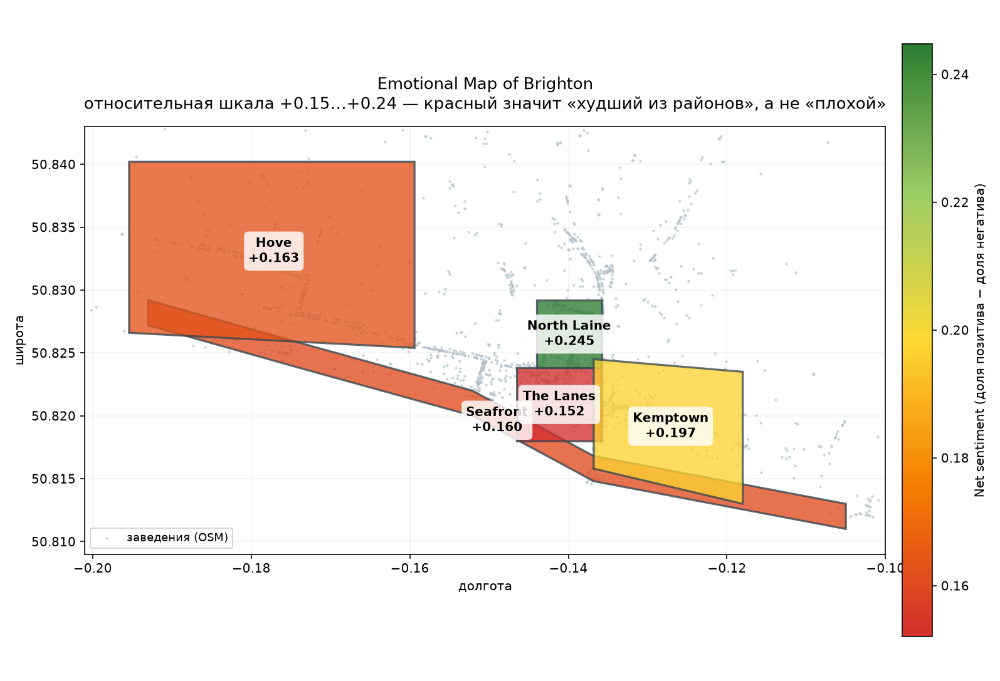
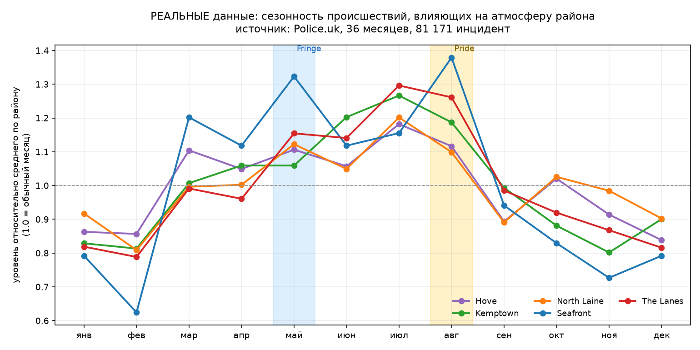
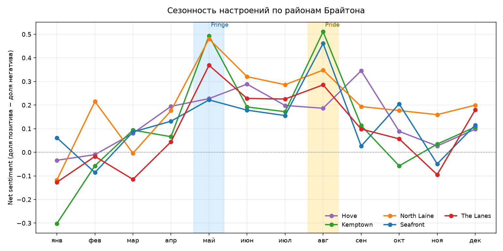
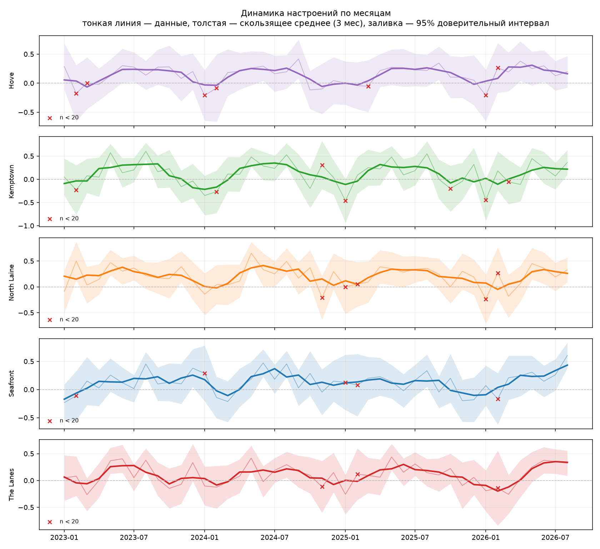

# 🌊 Emotional Map of Brighton

An interactive map of the emotional landscape of Brighton's neighbourhoods:
what people talk about where, in what mood, and how it shifts across seasons.

A complete ML pipeline - from raw data collection to a working dashboard.

*[Русская версия README](README.ru.md)*



---

## What this project does

| Stage | Task | Tools |
|---|---|---|
| **Geo collection** | ~2,000 Brighton venues with coordinates | OpenStreetMap Overpass API |
| **Text collection** | posts and comments about the city | Reddit API (PRAW) - *see caveat below* |
| **Open data** | 81,171 incidents across 36 months | Police.uk API (no keys required) |
| **Geo-linking** | point → district, text → district | shapely, name matching |
| **Sentiment** | polarity of each text | VADER vs DistilBERT |
| **Topics** | what people write about | keywords vs LDA vs BERTopic |
| **Time series** | seasonality, spikes, anomalies | pandas, z-scores |
| **Product** | map + filterable dashboard | Folium, Plotly, Streamlit |

---

## ⚠️ Honesty about the data

Three sources with very different status. Sorting out which is which is
the first thing a reader should do.

| Source | Status | Volume |
|---|---|---|
| OpenStreetMap | **real** | 1,988 venues with coordinates |
| Police.uk | **real** | 81,171 incidents, 36 months |
| Texts | **synthetic** | 7,434 generated |

**Why the texts are synthetic.** In November 2025 Reddit introduced its
[Responsible Builder Policy](https://support.reddithelp.com/hc/en-us/articles/42728983564564-Responsible-Builder-Policy)
and closed self-service API app registration. The `prefs/apps` page now
silently does nothing, and access is granted only through a manually
reviewed application. Unauthenticated requests return HTTP 403 - verified.
The `collect/reddit_texts.py` module is written and ready, but cannot run
without an approved key.

So `src/bem/collect/demo_corpus.py` generates a corpus for developing and
debugging the NLP pipeline. **No conclusions about the real Brighton can
be drawn from these texts**, and the dashboard says so on its first screen.

**Why not Google Places reviews.** Their Terms of Service prohibit storing
review content for more than 30 days or displaying it outside Google Maps -
unacceptable for a public portfolio repository.

**How the gap was filled.** Rather than leaving the project entirely on
synthetic data, I added the Police.uk API: no keys, Open Government Licence,
36 months of geo-referenced records. It is not a replacement for text -
there is no sentiment or topic structure in it - but it is a real view of
the same question: *what is it like to be in this neighbourhood?*

---

## Quick start

```bash
git clone <repo> && cd brighton-emotional-map

python3 -m venv .venv
.venv/bin/pip install -r requirements.txt
.venv/bin/pip install -r requirements-nlp.txt   # torch, transformers, bertopic

cp .env.example .env    # keys only needed for real Reddit data

./run_all.sh            # full pipeline, ~5 minutes
```

Dashboard:

```bash
PYTHONPATH=src .venv/bin/streamlit run app/streamlit_app.py
```

Tests:

```bash
PYTHONPATH=src .venv/bin/pytest -v
```

---

## Repository layout

```
brighton-emotional-map/
├── config/                    # everything configurable, no code edits needed
│   ├── districts.yaml         #   district boundaries (polygons)
│   ├── poi_categories.yaml    #   which OSM objects to fetch
│   └── text_keywords.yaml     #   district place names, topic keywords
│
├── src/bem/                   # reusable code (importable, tested)
│   ├── config.py              #   paths and secrets in one place
│   ├── collect/
│   │   ├── http.py            #   polite HTTP: backoff, retries, User-Agent
│   │   ├── osm_places.py      #   Overpass API + mirror failover
│   │   ├── reddit_texts.py    #   PRAW, authors hashed (needs approved key)
│   │   ├── police_uk.py       #   Police.uk API, no keys needed
│   │   └── demo_corpus.py     #   synthetic generator for development
│   ├── geo/districts.py       #   point-in-polygon
│   ├── nlp/
│   │   ├── cleaning.py        #   text cleaning
│   │   ├── text_linking.py    #   text → district
│   │   ├── sentiment.py       #   VADER and DistilBERT
│   │   └── topics.py          #   keywords, LDA, BERTopic
│   ├── analysis/
│   │   ├── timeseries.py      #   monthly series, seasonality, anomalies
│   │   └── ranking.py         #   shrinkage toward the global mean
│   └── viz/maps.py            #   Folium maps and static PNG
│
├── scripts/                   # runnable pipeline steps
│   ├── 01_collect_places.py       05_timeseries.py
│   ├── 02_collect_texts.py        06_build_outputs.py
│   ├── 03_sentiment.py            07_collect_police.py
│   └── 04_topics.py
│
├── notebooks/01_eda.ipynb     # exploration: look first, then decide what to code
├── app/streamlit_app.py       # dashboard
├── tests/                     # 28 tests
├── data/
│   ├── raw/                   # raw, git-ignored
│   ├── interim/               # intermediate, git-ignored
│   └── processed/             # final aggregates, committed
└── reports/figures/           # charts and maps
```

### What belongs in a notebook, and what belongs in `.py`

A question people often get wrong. The rule used here:

| Notebook | `.py` module |
|---|---|
| look at data once | run it many times |
| plot to understand | plot for a report |
| test a hunch | the hunch became code |
| output is understanding | output is a file on disk |

A notebook cannot be tested, cannot be imported, and is nearly impossible
to review in git - the diff is a soup of JSON. Logic that lives only in a
notebook breaks silently. So `notebooks/01_eda.ipynb` documents **how
decisions were made**, while the decisions themselves live in `src/` under
test.

---

## Results

### Sentiment: VADER vs DistilBERT

| Model | Accuracy | Macro-F1 | Texts/sec |
|---|---|---|---|
| VADER | 0.588 | 0.478 | ~23,000 |
| DistilBERT (SST-2) | **0.738** | **0.726** | ~300 |

DistilBERT is more accurate but **80× slower**. For a nightly batch job
that is irrelevant; for real-time it decides the answer.

**The finding that mattered more than the model choice.** DistilBERT is
trained on two classes and cannot say "neutral". It confidently labelled
the purely factual sentence *"The cafe is on the corner of Gardner Street"*
as positive with probability 0.97. The neutral class has to be constructed
manually, via a confidence threshold - and tuning that threshold gained
more than switching from VADER to a transformer:

| Threshold | Macro-F1 |
|---|---|
| 0.85 (intuitive) | 0.599 |
| 0.95 | 0.651 |
| **0.995 (tuned)** | **0.726** |

### Topics: the simplest method won

| Method | ARI | NMI | Time |
|---|---|---|---|
| **Keyword matching** | **0.381** | 0.383 | 0.7 s |
| LDA (10 topics) | 0.088 | 0.159 | 6 s |
| BERTopic (9 topics) | 0.093 | 0.275 | 37 s |

**This comparison has a flaw, and it should be stated before anyone else
finds it.** The demo corpus templates were written using the same
vocabulary that sits in the keyword list - the comparison is partly
circular. On real Reddit data the ranking could easily flip.

A second observation: a low ARI does not mean the model is useless. ARI
scores per-document agreement, while the product needs the **per-district
aggregate** - and BERTopic recovers that considerably better:

| District | BERTopic found | Ground truth |
|---|---|---|
| Kemptown | night / lively | nightlife, noise ✅ |
| North Laine | shops / independent | shopping_vibe ✅ |
| Hove | price, parking | parking, service ✅ |
| The Lanes | food | crowds, service ❌ |

### Seasonality in REAL data (Police.uk)



No synthetic data here - 81,171 incidents over 36 months, normalised to
each district's own average month.

**What it shows:**

* **Seasonality is real:** incidents affecting a neighbourhood's atmosphere
  are **1.54× more frequent** in summer than in winter (July 872 vs
  February 566 per month on average).
* **The peak is July, not August** - for four districts out of five.
* **Except Seafront:** the only district peaking in August (1.38× its
  normal level, 11.5% of its annual volume). That is exactly the geography
  the Brighton Pride parade runs through.
* **Counter-intuitive:** `anti-social-behaviour` actually **drops** in
  August (201 vs 252 in June). A mass city event does not automatically
  mean more disorder.

**This refuted my own hypothesis.** I had baked August into the synthetic
corpus as the year's main peak for four districts. Real data showed the
peak is in July, and the August effect is localised to the seafront. A good
illustration of why real data matters: a plausible assumption turned out to
be wrong in a checkable way.

A caveat without which none of the above should be read: the number of
*recorded* incidents is not the crime rate - it is the crime rate
multiplied by willingness to report and by police presence. Police.uk also
deliberately snaps coordinates to street centroids for victim privacy, so
map "hotspots" are partly an artefact.

### Seasonality on the demo corpus (pipeline validation)



The pipeline independently recovered both festivals planted in the data:
May (Fringe, net +0.365) and August (Pride, +0.358) against January
(−0.106). A z-score anomaly detector flagged 6 August and 4 May spikes
without any knowledge of the events calendar.

A subtle detail: **Hove is the only district with no August spike** -
precisely because the generator excludes it from the Pride districts. The
pipeline recovered not just the effect but its geography.



---

## Engineering decisions worth defending

**Rate-limit respect is code, not a claim.** During development I got
myself blocked: four heavy queries back-to-back with no pause, and Overpass
answered `406`, then started dropping TLS connections. That is where
`collect/http.py` gets its inter-request delay, exponential backoff, `406`
and `SSLError` in the retryable set, and where `osm_places.py` gets its
Overpass mirror failover.

**Privacy.** Reddit author names are never stored - only an irreversible
hash. You can tell two authors apart; you cannot recover an identity.

**Data and code are separated.** Raw data is git-ignored. Only aggregates
from `data/processed/` are committed.

**Tests target what fails silently.** 28 tests, the most valuable being
the ones asserting that known Brighton landmarks land in the right
district. A shifted polygon raises no error - it quietly relocates half
the venues to a neighbouring district, and the map still looks plausible.

---

## Bugs I found and fixed

A dedicated section, because interviews ask about this more often than
about architecture.

**1. A hole in the boundaries.** The Royal Pavilion - the city's most
famous landmark - fell into "other": there was an unclosed gap between
The Lanes and Kemptown around Old Steine. Caught by checking against a
list of known landmarks; now a test.

**2. Substring of another venue's name.** A text about "Donuts & Churros"
in Kemptown was routed to The Lanes, because a venue named "Churros"
exists there. The exact name occurred in two districts and was dropped as
ambiguous, leaving the short substring to hijack the match. Fixed with a
filter: a name is unusable if it is contained in a venue name from a
different district. Linking accuracy: 99.9% → **100%**.

**3. Geography leaking into topics.** The first BERTopic run produced a
"topic" called *north laine* containing 71% of that district's texts. The
model did its job honestly - the district name appears in every text and
separates them perfectly. But that is clustering by geography, which we
already know. Fixed with stopwords.

**4. Median on a bimodal distribution.** A two-class classifier's scores
cluster at ±1. The median of such a distribution was +0.96…+0.99 in
**every** district - all of them looked identical, and the "polarisation"
metric measured distribution shape rather than disagreement.

**5. Ranking by raw average.** The top venues list filled up with places
that had three reviews and a "perfect" score of 1.00. Fixed by shrinking
toward the city-wide mean (Bayesian average, the same trick IMDb's
Top 250 uses): a venue with 8 mentions at 0.88 now outranks one with 3
at 1.00.

**6. A colour scale that lies.** On a symmetric scale all five districts
came out identically green - the differences collapsed. Stretching the
scale to the data range is tempting, but then a district at +0.15 turns
red and reads as "bad". Solution: two maps, with the relative one stating
in its legend that red means "worst of five", not "bad".

---

## When a data source disappears mid-project

This project was designed around Google Places reviews, moved to Reddit
over Terms of Service, and then Reddit closed app registration. Two out of
two sources fell away for reasons unrelated to the code.

What made that survivable without a rewrite:

* **A single output schema for every collector.** They all emit the same
  columns, so the rest of the pipeline neither knows nor needs to know
  where the data came from.
* **Config over constants.** District boundaries, object categories and
  keywords live in YAML. Switching sources requires no code changes.
* **A demo generator.** It let the NLP half reach completion without
  access - and it is labelled as synthetic everywhere it surfaces.

---

## Next steps

* **Find a replacement for the text source.** Reddit is closed; candidates
  include archived Reddit dumps, forums, and local news sites with
  comments. Once real text exists, re-run the topic-method comparison:
  on the demo corpus the keyword method has an unfair advantage.
* **Connect the two sources.** Police.uk data and the texts currently sit
  side by side without intersecting. An interesting question: do the
  districts where people complain about noise in text match the districts
  where police record `public-order` offences?
* **Fine-tune the sentiment model on British colloquial English.** SST-2
  was trained on film reviews; *"proper lush"* and *"bit grim"* are
  foreign vocabulary to it.
* **Use real district boundaries** instead of hand-drawn polygons.
* **More data per cell.** The median is currently 31 texts per
  district × month, with 12% of cells below the reliability threshold.

---

## Stack

Python 3.14 · pandas · shapely · scikit-learn · VADER · transformers
(DistilBERT) · BERTopic · Folium · Plotly · Streamlit · pytest

## Data licences

* **OpenStreetMap** - ODbL, attribution required. Attributed on the map.
* **Police.uk** - Open Government Licence v3.0, attribution required.
  Attributed on the chart and in this README.
* **Reddit** - collected through the official API, author names hashed,
  raw text never committed. Access has required an approved application
  since November 2025.
